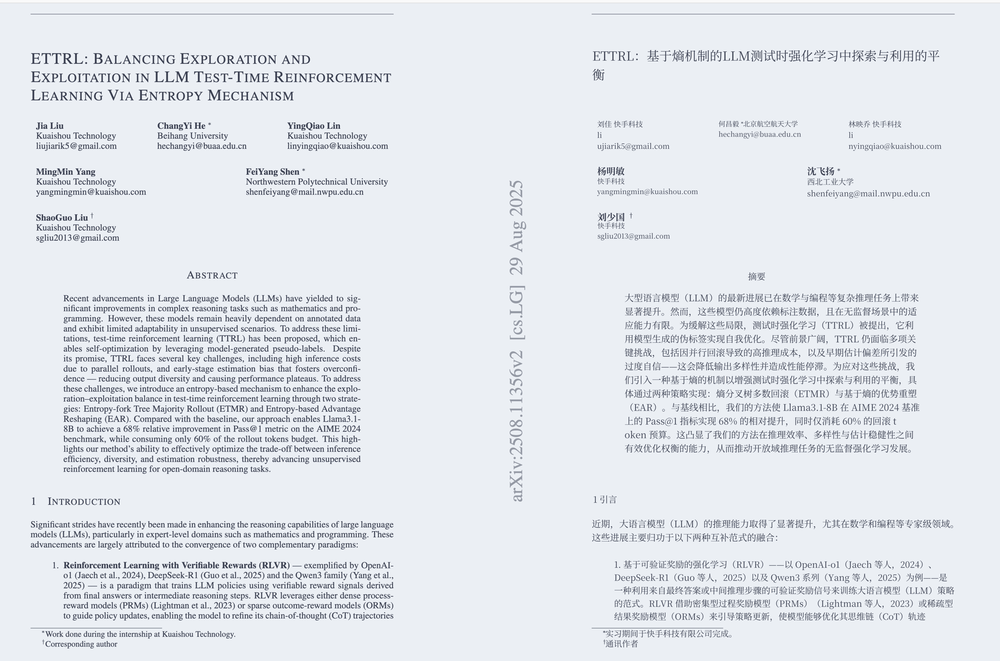
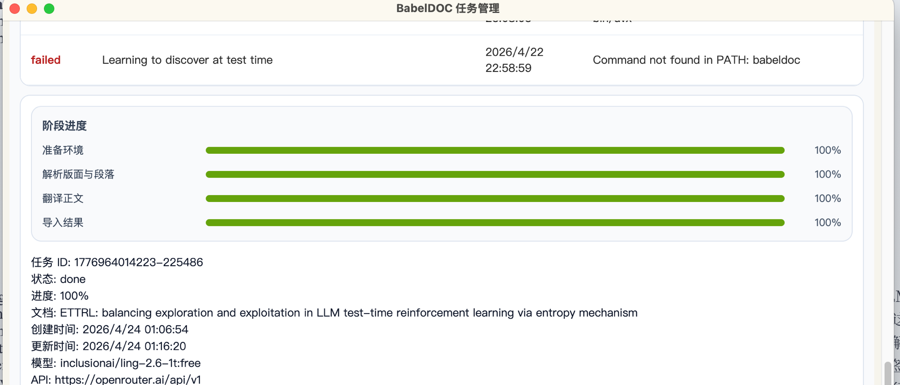

# Zotero BabelDOC Side-by-Side

一个面向 `Zotero 8.0.5 ~ 9.*` 的本地翻译插件。直接从 Zotero 里调用本机 `babeldoc` CLI，把生成的双语 PDF 再导回 Zotero。

默认输出模式是 BabelDOC 的双语对照 PDF：

- 保留原文排版
- 生成 side-by-side 同页对照
- 翻译完成后可自动打开结果附件

### 翻译效果



### 任务管理



## 当前实现

- 右键条目/附件，直接触发 PDF 翻译
- `Tools -> BabelDOC 翻译` 菜单里提供：
  - 翻译当前选中 PDF
  - 打开设置
  - 查看最近任务
- `View` 菜单也可直接打开任务管理器
- 翻译前二次确认
- 真正的任务队列与任务管理窗口
- 关闭 Zotero 后恢复未完成任务
- 快捷键：
  - `Shift + A` 翻译当前选中条目
  - `Shift + T` 打开任务管理器
- 使用本地 `babeldoc` 命令执行翻译
- 默认只保留双语 PDF，不生成单语 PDF
- 翻译结果自动导入 Zotero，并挂回原条目下
- 任务记录持久化到 Zotero 数据目录
- 失败任务可在任务管理器里重试
- 用户自行配置 OpenAI 兼容模型，无第三方服务依赖

## 依赖

你需要先在本机准备可执行的 `babeldoc` 命令，以及一个 OpenAI 兼容翻译接口。

可选命令示例：

```bash
babeldoc
```

```bash
uvx --from BabelDOC babeldoc
```

```bash
python -m babeldoc
```

## 构建

```bash
npm install
npm run build
```

构建完成后，安装包在 `build/babel-doc-side-by-side.xpi`。

## 安装

1. 在 Zotero 8.0.5 中打开 `Tools -> Plugins`
2. 点击右上角齿轮
3. 选择 `Install Plugin From File...`
4. 选择上面的 `.xpi`

## 配置

安装后打开：

`Tools -> BabelDOC 翻译 -> BabelDOC 设置`

至少需要配置这些内容：

- BabelDOC 命令
- 源语言/目标语言
- OpenAI 兼容接口 Base URL
- 模型名
- API Key（本地兼容服务可留空）

可选能力：

- 自定义 system prompt
- 附加 BabelDOC CLI 参数
- 是否保留翻译前确认
- 是否自动打开结果
- side-by-side / 交替页模式选择

如果你希望继续保持 side-by-side 同页对照，请在设置里对“交替页双语模式”选择“否”。

## 使用

1. 在文库里选中 PDF 附件，或选中带 PDF 附件的父条目
2. 右键选择 `使用 BabelDOC 翻译 PDF`
3. 在确认框里检查目标语言、模型和任务数量
4. 任务进入队列，任务管理窗口自动打开
5. 插件会把双语 PDF 导回 Zotero，并可自动打开结果

## 已知限制

- 插件本身不内置 Python/BabelDOC，需要本机已有可运行命令
- 自动更新地址已置空，当前版本按本地手动安装/更新方式使用

## 致谢 / References

本项目在开发过程中参考了以下开源项目的交互设计与插件架构：

- [immersive-translate/zotero-immersivetranslate](https://github.com/immersive-translate/zotero-immersivetranslate) — 参考了其 Zotero 插件的 UI 交互流程与菜单结构设计
- [windingwind/zotero-plugin-template](https://github.com/windingwind/zotero-plugin-template) — Zotero 插件脚手架模板
- [BabelDOC](https://github.com/funstory-ai/BabelDOC) — 底层 PDF 双语翻译引擎（本插件通过 CLI 调用）
- [zotero-plugin-toolkit](https://github.com/windingwind/zotero-plugin-toolkit) — Zotero 插件开发工具库
